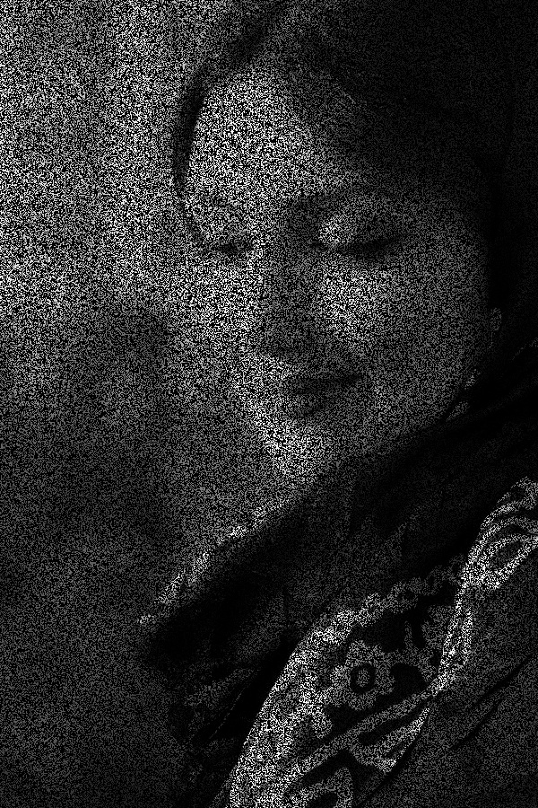
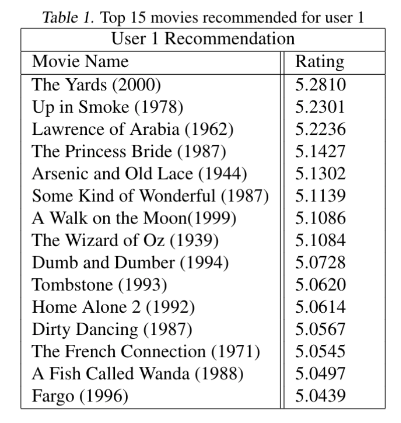

# Matrix-Completion

Sometimes also called the Netflix Problem, The main task in this problem is to fill or complete the missing entries of an incomplete matrix M.

In this project we explore and analyze several algorithms to solve the matrix completion problem such as Convex Relaxation, SVD and RPCA, and its corresponding implementation.

For a detailed explanation and formulation of such algoriths refer to the [project report](https://github.com/jwilliamn/Matrix-Completion/blob/master/Final_Project_Report.pdf).
We also made a presentation easy to understand, here [slides](https://github.com/jwilliamn/Matrix-Completion/blob/master/Final_Project_Report.pdf).

Here we show some results of the matrix completion applied to an image:

Original Image             |  Incomplete Image
:-------------------------:|:-------------------------:
  |  


After performing matrix completion on the incomplete image we get:
Original Image             |  Complete Image
:-------------------------:|:-------------------------:
  |  

And here applied to Movie Recommender System:



## Reproducibility
To reproduce the results of the experiments, follow the guidelines below:

### Prerequisites
A machine that supports the following packages

- Pillow
- numpy
- cvxpy
- scikit-image 
- opencv-python

### Getting Started

Installation:

- Clone this repository:
```bash
git clone https://github.com/jwilliamn/Matrix-Completion
cd Matrix-Completion
```

- Install requirements:
```bash
pip install -r requirements.txt
```

### 1. Nuclear Norm
Run the notebook: [`NuclearNorm.ipynb`](https://github.com/jwilliamn/Matrix-Completion/blob/master/NuclearNorm.ipynb)

To change the data distortion modify the following parameter:
```python
noise = [0.1, 0.2, 0.3, 0.4, 0.5, 0.6]
```
Notes: Slow

### 2. SVT
Run the notebook: [`SVT_image.ipynb`](https://github.com/jwilliamn/Matrix-Completion/blob/master/SVT_image.ipynb) for Image Inpainting, and [`SVT_movie_recommender.ipynb`](https://github.com/jwilliamn/Matrix-Completion/blob/master/SVT_movie_recommender.ipynb) for Movie Recommender System

Change the following parameter for a different noise levels:
```python
p = [0.1, 0.2, 0.3, 0.4, 0.5, 0.6]
```
### 3. RPCA
Run the notebook: [`RPCA.ipynb`](https://github.com/jwilliamn/Matrix-Completion/blob/master/RPCA.ipynb) for Movie Recommender System

## Data set
- For recommeder system we used [MovieLens Latest Datasets](https://grouplens.org/datasets/movielens/latest/)
    
    Small version: 100,000 ratings and 3,600 tag applications applied to 9,000 movies by 600 users.

- Image inpainting, we used the following [picture](https://github.com/jwilliamn/Matrix-Completion/blob/master/persian_girl.jpg)

Note: Only SVT algorithm was applied to both datasets, while Nuclear norm (Convex relaxation) and Robust PCA were applied just to Image.

## References:
- Robust PCA, https://github.com/vincenzobaz/RobustPCA/blob/master/code/robust_pca.py
- Nuclear Norm, https://github.com/tonyduan/matrix-completion/blob/master/matrix_completion/nuc_solver.py